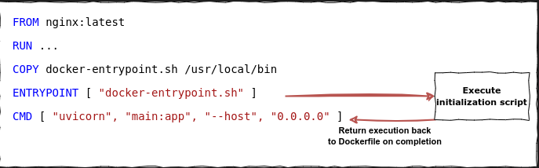

When developing a docker file, wrapping various initialization commands in a shell script (typically named `docker-enterypoint.sh`) and executing that script through an `ENTRYPOINT` instruction is a common pattern.

The goal of this technique is to provide a flexible and configurable way to initialize and configure the Docker container at runtime. Run time initializations are things like starting up a service, exporting environment variables, or just editing some config files.



## Choosing Between `RUN` and `ENTRYPOINT`

Before explaining how to return the execution flow from `ENTRYPOINT` to `CMD`, it's important to understand the difference between `RUN` and `ENTRYPOINT`. In a Dockerfile, `RUN` is used to execute commands during the image build process (build-time) to create the container's file system. It is typically used for tasks such as installing packages, setting up dependencies, or compiling code. On the other hand, `ENTRYPOINT` is used to specify the command that will run when a container is started from the image (run-time), defining the container's primary executable.

This distinction is the main reason why it is common to encapsulate all runtime configurations within a docker-entrypoint.sh script and execute it through an `ENTRYPOINT` for dynamic initialization tasks before launching the main application.

## Getting back to `CMD` after executing `ENTRYPOINT`

So far, we've learned that you can provide dynamic configuration to the container through the `docker-entrypoint.sh` script executed by the `ENTRYPOINT` instruction. To return the execution flow from this script to the Dockerfile's `CMD`, simply add an `exec "@$"` statement at the very end of the `docker-entrypoint.sh` file.

Let's break down what `exec "@$"` does:

- `exec` is a Linux command used to replace the current process with a new process. In this case, it ensures that the subsequent command specified by `"$@"` becomes the main process running in the container.
- `"$@"` expands to all the command-line arguments passed to the container when it starts. It preserves the exact arguments that were passed during container runtime.

By using exec `"$@"`, the `docker-entrypoint.sh` script effectively forwards any command-line arguments passed to the container to the specified command or entry point defined by `CMD`.

For example, let's say you have a Dockerfile with the following lines:

```dockerfile
.
.
ENTRYPOINT ["docker-entrypoint.sh"]
CMD ["fooapp", "--args", "value"]
```

If you run the container with the following command:

```sh
docker run fooimage --more-args
```

The docker-entrypoint.sh script, when executed with exec "$@", will effectively run:

```sh
fooapp --args value --more-args
```
