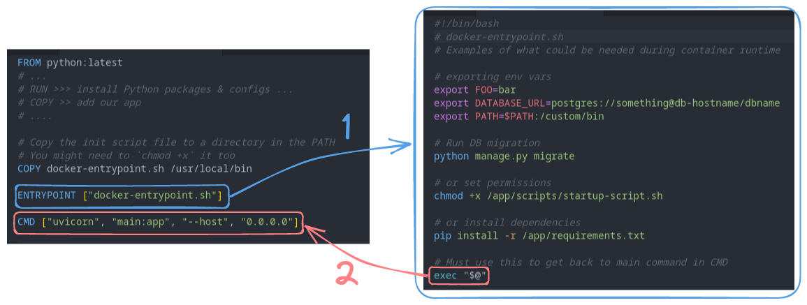

In this post, I will demonstrate how `ENTRYPOINT` and `CMD` work together, their differences, and how to redirect the runtime execution flow from `ENTRYPOINT` to the `CMD` where the main application's command is executed.

## The way `ENTRYPOINT` and `CMD` work together

In most cases, `CMD` and `ENTRYPOINT` instructions can be used interchangeably. Also, you do not have to use both of them together in every Dockerfile you develop. However, each instruction offers additional features that can help you control how you want to run your application. Before moving forward, let's quickly review what each instruction does:

- `ENTRYPOINT` is like the "main command" or the starting point for your container. It's the default action the container takes when you run it. You might use `ENTRYPOINT` to start a web server or run a specific application.

- `CMD` can be used to provide additional arguments or options to the command specified in `ENTRYPOINT`. It's like saying, "When you start the container using the `ENTRYPOINT` command, here are some extra args to pass to the executing app". It is often used to pass *default* arguments to `ENTRYPOINT`. Note that we said: "default arguments" which we'll explain what does that mean in a bit.

So, `ENTRYPOINT` sets the main command of the container, and `CMD` provides default arguments to that command. Here is an example:

```dockerfile
FROM ubuntu
ENTRYPOINT ["echo"]
CMD ["Hello world"]
```

Running a container from this Dockerfile is similar to executing `echo "Hello world"` in the command line. The `echo` is the main app and `Hello world` is the argument. Similarly, in the Dockerfile above, the content of the `CMD` instruction is passed to the `ENTRYPOINT` as the default argument. when we build and run the container without arguments it will print "Hello world":

```sh
docker build -t test .
docker run test
```

Output:

```test
Hello world
```

### Overriding `CMD`

To override the `CMD` that is defined in the Dockerfile (*default* argument), you just pass the argument(s) after the image name:

```sh
docker run test 'another hello world'
```

Output:

```text
another hello world
```

This method also overrides the `CMD` whether it's used in combination with `ENTRYPOINT` instruction or not.

### Overriding `ENTRYPOINT`

Given this Dockerfile:

```dockerfile
FROM ubuntu
ENTRYPOINT ["echo", "Hello world"]
```

When you have a Dockerfile with only an `ENTRYPOINT` (i.e. no `CMD`), you need to use the  `--entrypoint` flag to override the entry-point command as the following:

```sh
# docker run --entrypoint <command> <image>
docker run --entrypoint 'printenv' test
```

Output:

```text
PATH=/usr/local/sbin:/usr/local/bin:/usr/sbin:/usr/bin:/sbin:/bin
HOSTNAME=7ffd59696373
HOME=/root
```

If you try to supply a command at runtime without specifying the `--entrypoint` flag, Docker will treat the that command as additional arguments to the command specified in the `ENTRYPOINT`:

```sh
docker run test 'printenv'
```

Output:

```text
Hello world printenv
```

This is similar to an entry-point in Dockerfile like this: `ENTRYPOINT ["echo", "Hello world", "printenv"]`

## Handing over execution flow from `ENTRYPOINT` to `CMD`

Consider the following Python Flask app:

```dockerfile
FROM python:latest
# ...
# RUN >>> install Python packages & configs ...
# COPY >>> add files and executables
# ...
ENTRYPOINT ["uvicorn"]
CMD ["main:app", "--host", "0.0.0.0"]
```

The uvicorn command will be executed when the container runs, and the `CMD` instruction will provide the necessary arguments for the uvicorn server.

Usually, we need a way to include runtime configurations that our Flask app expects to be available in the run environment prior to executing the main application in the entry-point (e.g. `uvicorn`). These configurations could be starting a service, exporting environment variables, running a database migration script, or simply editing certain configuration files.

This type of commands (runtime commands) cannot be included in `RUN` stages, and it is an anti-pattern and honestly quite ugly to cram a lot of shell commands into the `ENTRYPOINT` and/or `CMD` sections.

### Enter "docker-enterypoint.sh"

When developing a Dockerfile, it is a common pattern to wrap various initialization commands within a shell script, conventionally named 'docker-entrypoint.sh' or 'entrypoint.sh' and execute it using an `ENTRYPOINT` instruction prior to running the main app. The purpose of this technique is to provide a flexible way of configuring the Docker container environment *at run time*.

Since `ENTRYPOINT` instruction provides run-time execution, we need to find a way to return the execution flow back the Dockerfile's `CMD` instruction to run the main application command.

To do so, simply add an `exec "@$"` statement at the very end of the shell script that is being executed by the `ENTRYPOINT` (i.e. 'docker-entrypoint.sh') file.

After adding all configuration scripts to 'docker-entrypoint.sh,' we will modify the Dockerfile as follows:

```dockerfile
FROM python:latest
# ...
# RUN >>> install Python packages & configs ...
# COPY >> add our app
# ....

# Copy the init script file to a directory in the PATH
# You might need to `chmod +x` it too
COPY docker-entrypoint.sh /usr/local/bin 

ENTRYPOINT ["docker-entrypoint.sh"]

CMD ["uvicorn", "main:app", "--host", "0.0.0.0"]
```

To visualize the process:



When we run the container, Docker will execute the `ENTRYPOINT`, which contains the "docker-entrypoint.sh" script. Then, the `exec "$@"` command in the "docker-entrypoint.sh" script will, in a sense, return control to the `CMD`. To clarify, the exec part won't transfer execution flow; it just expands the arguments specified in the `CMD` instruction in a new process.

Let's break down what `exec "@$"` does:

- `exec` is a Linux command used to replace the current process with a new process. In this case, it ensures that `"$@"` becomes the main process running in the container.
- `"$@"` expands to all the command-line arguments passed to the container when it starts (e.g. expanding the content of the `CMD` instruction). It preserves the exact arguments that were passed during container runtime. Also, you still can override the `CMD` by specifying args on the `docker run` command. Finally, note that you cannot place any commands in the 'docker-entrypoint.sh' file after the exec "$@" line.
