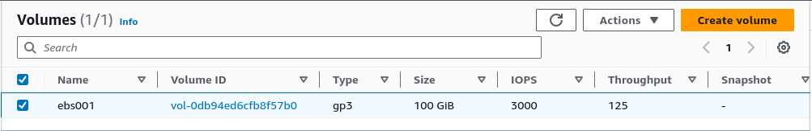
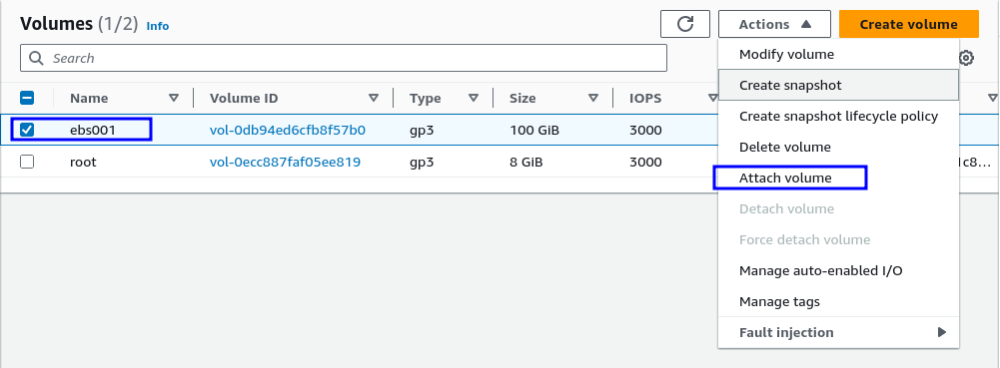
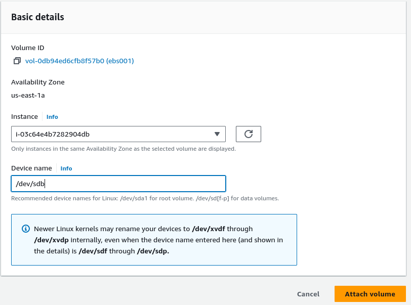
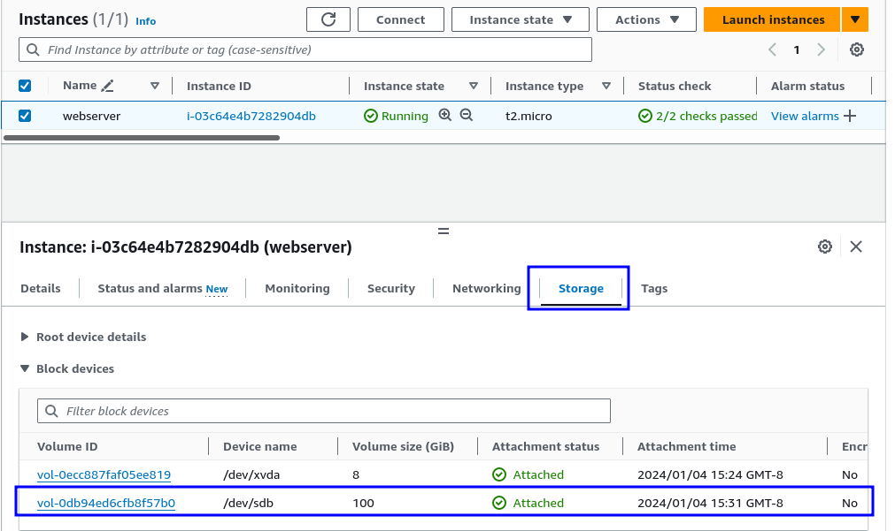
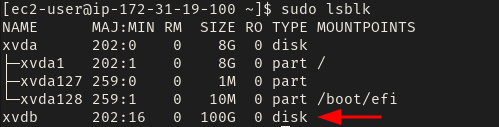
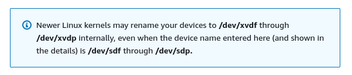
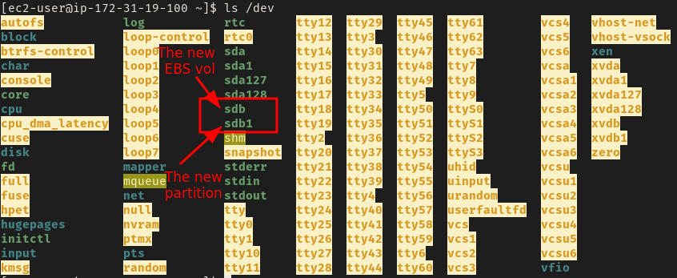
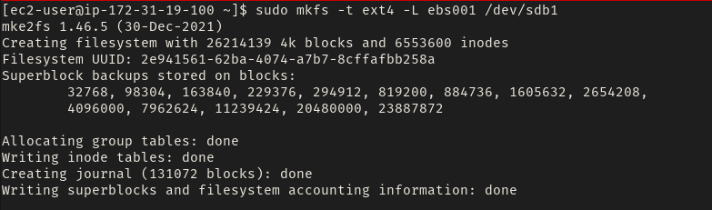
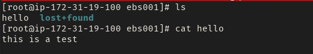

This post is designed for those new to AWS, showing the steps to attach a new EBS volume and mount it in the operating system. The goal of mounting a data volume is to maintain a clear separation between your application data and the operating-system's data.

Initializing EBS volumes is important also when working with Auto Scaling Groups (ASG). Auto Scaling Groups use launch templates, which contain information such as the Amazon Machine Image (AMI), SSH keys, and more, to deploy new EC2 instances during scaling events. An AMI captures the state of the root volume and any additional attached EBS volumes, including their mount points. If you attach an EBS volume, mount it to a specific directory like `/foo`, and then create an AMI from that EC2 instance, the information about the attached EBS volume and its mount point will be preserved.

## Requrements

- AWS account (duh!)
- Adequate IAM permissions for EC2 and EBS (launch, attach/detach volumes).
- Basic familiarity with Linux storage mechanisms.

Before we start, I'd like to mention that all the steps here can be automated using the AWS CLI/SDK, or your preferred Infrastructure as Code (IaC) tool. In this instance, we'll walk through the console setup for clarity.

**Disclaimer**
This post will focus on provisioning a new volume, including the formatting process. Adding a new partition to a partially used volume is beyond the scope of this blog, and following the steps below will effectively wipe all the content from the specified volume.

## Step 1: Create an EBS volume

Set your volume settings as you wish, just make sure it's in the same AZ as the target EC2 instance.



## Step 2: Attache the EBS volume to your EC2 instance

My running EC2 instance is called `webserver` and I will name the volume as `/dev/sdb`. This volume name should be reflected in the `/dev` directory once the volume is attached successfully. 





Once attachment is successful, you should see the new volume in the main console



## Step 3: Configure the new volume

When you add a new EBS volume to an EC2 instance in AWS, you generally need to follow similar steps as you would with on-premises servers. What we did above is just attaching a disk to a server, exactly like you would do on a physial server (or a volume to a VM in a type 1 hypervisor).

So we need to SSH into the server and do configure the volume.

### SSH into the EC2 Instance

Make sure you have proper permissions to format, partition, and mount disks. 

### Identify the New Volume

Run the `lsblk` (List Block Devices) command and list all disks on the system and try to identify the newly added volume



The `lsblk` command is handy for checking disk information, including where a disk is mounted. If you look at the output above, you'll see that our recently added volume isn't mounted yet. You might also wonder why it's labeled as `xvdb` instead of the expected `sdb`. This change is due to a new naming system in the Linux kernel. Take a look at the highlighted box in the previous screenshot for more details



### Install a partition table

Once the disk is identified, we need to install a partition table. 

> A partition table is a data structure on a storage device that defines the sections used for organizing data on the disk.

Run the `fdisk` command and follow the instructions specfied in the code block below

```text
$ sudo fdisk /dev/sdb 

Welcome to fdisk (util-linux 2.37.4).
Changes will remain in memory only, until you decide to write them.
Be careful before using the write command.

Device does not contain a recognized partition table.
Created a new DOS disklabel with disk identifier 0xf8a58774.

Command (m for help): g
Created a new GPT disklabel (GUID: AC3E4A5C-F60F-5B42-85BB-B019A99EB6D0).

Command (m for help): n
Partition number (1-128, default 1): 
First sector (2048-209715166, default 2048): 
Last sector, +/-sectors or +/-size{K,M,G,T,P} (2048-209715166, default 209715166): 

Created a new partition 1 of type 'Linux filesystem' and of size 100 GiB.

Command (m for help): w
The partition table has been altered.
Calling ioctl() to re-read partition table.
Syncing disks.
```

1. Enter `g` and hit enter, this will create a GPT partition table.
2. Enter `n` and hit enter, this will create new partitio.
3. Hit Enter, this will instruct `fdisk` to use all the free space in the disk to the new partition.
4. Enter `w` and hit enter, this will write the new partition to the disk.

### Check device partitions

The `/dev` directory is where device files are located, and devices like hard drives can have sequential names and additional entries representing partitions. For example, if you have a device named /dev/sdb, it might be the entire storage device. The partitions on that device are then represented by appending a number to the device name, such as /dev/sdb1, /dev/sdb2, and so on.

So now we have our disk device and it has one partition (from the previous step), we should see the following devices `/dev/sdb` and `/dev/sdb1` in `/dev`



### Create a file system

Use the `mkfs` tool to create a file system on the new partition.



The `-t` option allows us to select the type of the file system; in this case, I will use `ext4`. The `-L` option can be any meaningful name for your volume. We will use that label in the `LABEL` option in the next step when we mount the file system, so be sure to use a helpful name.

### Mount the new file system

Create a new directory (or use an existing one), and mount the new file system to it

```sh
$ sudo mount LABEL=ebs001 /ebs001 
```

Check the mount point

```sh
$ ls /ebs001

lost+found
```

Let's add a file to it for testing



The volume is now ready, allowing the EBS volume to easily be detached from its current EC2 instance and attached to another instance without any data loss. This volume is ideal for storing your application data, such as serving as a mount point for a Docker volume, which will keep the application data separated from the EC2 root volume at all times.
