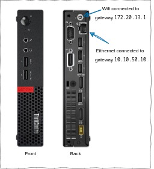

Having multiple network interfaces on one machine can be pretty handy. It gives you network backup and helps you bounce back if the network gets a bit erratic. So, in this post, I'll walk you through setting up a 'default gateway' on one interface to handle outbound traffic (internet), while keeping the second one reserved just for LAN networking. Also, I'll share some quirky bits I had to figure out along the way


## Setting the stage

I have a mini PC (ThinkCentre M710q) running Debian 11. This device is equipped with two network interfaces: one is an Ethernet port, and the other is a Wi-Fi device.



I also have access to two totally different networks. So, this arrangement allows the host to connect to two different, publicly routable IP addresses via two different gateways. My plan is to connect use ethernet port for local networking, and use the wifi interface for internet traffic. To make this happen, we just need to make sure the host always selects the wifi-interface's gateway as the default gateway.

## Gateway and interfaces configuration

First, make sure that each interface is connected to its corresponding network and has been assigned a DHCP IP from its respective gateway.

### 1. Identify the interfaces

Open a terminal window and run `ip address show` or `ip a` for short:

```text
user@host:~$ ip addr
1: lo: <LOOPBACK,UP,LOWER_UP> mtu 65536 qdisc noqueue state UNKNOWN group default qlen 1000
    link/loopback 00:00:00:00:00:00 brd 00:00:00:00:00:00
    inet 127.0.0.1/8 scope host lo
       valid_lft forever preferred_lft forever
    inet6 ::1/128 scope host 
       valid_lft forever preferred_lft forever
       
2: enp0s31f6: <BROADCAST,MULTICAST,UP,LOWER_UP> mtu 1500 qdisc pfifo_fast state UP group default qlen 1000
    link/ether 6q:4b:40:29:2x:e1 brd ff:ff:ff:ff:ff:ff
    inet 10.10.50.36/24 brd 10.10.50.255 scope global dynamic noprefixroute enp0s31f6

3: wlp2s0: <BROADCAST,MULTICAST,UP,LOWER_UP> mtu 1500 qdisc noqueue state UP group default qlen 1000
    link/ether 1a:3b:70:31:51:63 brd ff:ff:ff:ff:ff:ff
    inet 172.20.13.25/16 brd 172.20.255.255 scope global dynamic noprefixroute wlp2s0
       valid_lft 70380sec preferred_lft 70380sec
```

In the output above I have two active interfaces; both are up, and each has been assigned a DHCP IP:

1. Ethernet interface: `enp0s31f6`
2. Wifi interface: `wlp2s0`

### 2. Identify the default gateway for each interface

We need to know each gateway's IP address to set up the default gateway on the host. We can find that using the `ip route` command

```text
user@host:~$ ip route
default via 10.10.50.10 dev enp0s31f6 proto dhcp metric 100 
default via 172.20.1.1 dev wlp2s0 proto dhcp metric 600 
```

From the output above, each interface has the following information

| Interface | Gateway | Assiged DHCP IP |
| --- | --- | --- |
| enp0s31f6 | 10.10.50.10 | 10.10.50.36 |
| wlp2s0 | 172.20.1.1 | 172.20.13.25 |

### 3. Reset the default gateway

The operating system currently uses `10.10.50.10` as the default gateway. To switch the default gateway to `172.20.1.1`, we need to delete the default gateway and then set the second one as the default gateway.

Since each gateway represents a publicly routable IP address, let's take note of the current public IP address on the host before updating the gateways:

```text
user@host:~$ curl ifconfig.me
<Output=Network-1-Public-IPv4>
```

Now let's delete the current default gateway `10.10.50.10`:

```text
user@host:~$ ip route del default
```

Set the default gateway to the interface we want (wifi interface):

```text
user@host:~$  ip route add default via 172.20.1.1 dev wlp2s0 
```

Check the public IP address again (it should return the second network's public IP address):

```text
user@host:~$  curl ifconfig.me
<Output=Network-2-Public-IPv4>
```

### Verify gateway change using `tcpdump`

You can use `tcpdump` to verify that the public traffic has been re-routed to the second gateway (wifi NIC).

`tcpdump` is a command line tool used to capture network traffic in real-time. It is a widely-used tool for troubleshooting networks and analyzing network activity.

In our case, `tcpdump` can capture packets that are sent and received through the wifi NIC on the secondary gateway. This allows us to gather detailed information about each packet, including the source and destination addresses. Consequently, we can determine whether the host utilizes the wifi-NIC's gateway as the default gateway.

Run `tcpdump -D` as a root user to list active interfaces:

```text
root@host:~# tcpdump -D
1.enp0s31f6 [Up, Running, Connected]
2.wlp2s0 [Up, Running, Wireless, Associated]
```

Run `tcpdump -i wlp2s0 -n -nn` and inspect the output, note that we are using the `-i` flag to target the wifi interface:

```text
root@host# tcpdump -i wlp2s0 -n -nn 
[1] 11:54:37.300783 ARP, Reply 172.20.1.1 is-at 00:50:e8:04:5f:73, length 46
[2] 11:54:37.300785 ARP, Reply 172.20.1.1 is-at 00:50:e8:04:5f:73, length 46
[3] 11:54:37.300786 ARP, Reply 172.20.1.1 is-at 00:50:e8:04:5f:73, length 46
[4] 11:54:37.300786 ARP, Reply 172.20.1.1 is-at 00:50:e8:04:5f:73, length 46
[5] 11:54:37.529574 IP <Network-IP>.43681 > 146.70.172.2.18748: UDP, length 176
[6] 11:54:37.881405 IP 146.70.172.2.18748 > <Network-IP>.43681: UDP, length 384
[7] 11:54:42.530855 IP <Network-IP>.43681 > 146.70.172.2.18748: UDP, length 176
[8] 11:54:42.737942 IP 146.70.172.2.18748 > <Network-IP>.43681: UDP, length 384
```

> Note: the `<Network-IP>` is the redacted wifi-NIC's public IP address.

From the output, we can identify the following:

- Lines 1 to 4 show that the interface communicates with the default gateway we configured previously.
- Lines 5 to 8 show that the interface's local IP and a remote destination are talking to each other.

Now let's do the same thing with the ethernet interface:

```text
root@host# tcpdump -i wlp2s0 -n -nn 
12:07:30.306031 IP 10.10.50.36.22 > 10.10.50.209.40122: Flags [P.], seq 1088064413:1088064609, ack 4151802530, win 501, options [nop,nop,TS val 703782894 ecr 4187823825], length 196
12:07:30.306385 IP 10.10.50.209.40122 > 10.10.50.36.22: Flags [.], ack 196, win 18695, options [nop,nop,TS val 4187823851 ecr 703782894], length 0
12:07:30.395515 IP 10.10.50.36.22 > 10.10.50.209.40122: Flags [P.], seq 196:568, ack 1, win 501, options [nop,nop,TS val 703782984 ecr 4187823851], length 372
12:07:30.395740 IP 10.10.50.209.40122 > 10.10.50.36.22: Flags [.], ack 568, win 18695, options [nop,nop,TS val 4187823940 ecr 703782984], length 0
12:07:30.499285 IP 10.10.50.36.22 > 10.10.50.209.40122: Flags [P.], seq 568:916, ack 1, win 501, options [nop,nop,TS val 703783088 ecr 4187823940], length 348
12:07:30.499721 IP 10.10.50.209.40122 > 10.10.50.36.22: Flags [.], ack 916, win 18695, options [nop,nop,TS val 4187824044 ecr 703783088], length 0
12:07:30.603219 IP 10.10.50.36.22 > 10.10.50.209.40122: Flags [P.], seq 916:1264, ack 1, win 501, options [nop,nop,TS val 703783192 ecr 4187824044], length 348
12:07:30.603720 IP 10.10.50.209.40122 > 10.10.50.36.22: Flags [.], ack 1264, win 18695, options [nop,nop,TS val 4187824148 ecr 703783192], length 0
12:07:30.707004 IP 10.10.50.36.22 > 10.10.50.209.40122: Flags [P.], seq 1264:1612, ack 1, win 501, options [nop,nop,TS val 703783295 ecr 4187824148], length 348
```

The output above may seem verbose due to an ongoing TCP communication, with tcpdump displaying all the steps involved in the TCP connection process.

The interface's IP: `10.10.50.36` is engaged in communication with a local destination on the same subnet: `10.10.50.209`, and vice versa, over port 22. (This is an active SSH tunnel from my laptop to the device.) The `tcpdump` output is not showing any active WAN communication on this interface.

Mission accomplished! Now all WAN traffic is routed through gateway `172.20.1.1`, and the ethernet interface that's connected to gateway `10.10.50.10` is only available for LAN connections.

## Some gotchas

During *boot-time network configuration*, a race condition is likely to occur regarding which interface the operating system will utilize to set the default gateway.

Boot time network configuration is all about getting a host's network interfaces ready to communicate when the OS is firing up. Basically, it's setting up things like IP address, the network essentials, including the gateway address, so your device can link up with the network and chat with other devices. The operating system figures out the default gateway based on the first NIC that obtains an IP address and gateway info from its own gateway.

In my experience, the OS always seems to prefer the Ethernet interface when it's setting up the default gateway. I think this is due to the fact that Ethernet uses dedicated physical cables for communication, while the wifi interface relies on wireless signals, which can be affected by interference and signal strength. This can make wifi take a couple of seconds to catch up.

Regardless, there are two solutions to remedy such a situation:

### 1. Use `/etc/rc.local` or `systemd/rc-local.service`

Basically, add the "delete-gateway" -> "set-gateway" commands explained above to the `/etc/rc.local`. The `/etc/rc.local` is a script file that is executed by the Linux init system during the boot process. The commands or scripts in the file are executed with root privileges, so it is important to use caution when modifying the file.

Note that the `/etc/rc.local` file is deprecated in some Linux distributions, such as Ubuntu and Debian, in favor of `systemd`. Systemd uses its own mechanism for executing scripts and services at boot time, and the equivalent of the `/etc/rc.local` file in `systemd` is the `/etc/systemd/system/rc-local.service` file.

### 2. Use the good ol' cron

Add a CRON schedule to run the "delete-gateway" -> "set-gateway" commands. This approach might introduce some network interruption when CRON is triggered. So wrapping these commands in a shell script with some `if`-`else` logic would be a good idea to check if the gateway has changed during boot time before updating it.

Example:

```bash
#!/bin/bash 

SECOND_NETWORK_GATEWAY="172.20.1.1"
CURRENT_PUBLIC_IP="$(curl ifconfig.me)"
SECOND_NETWORK_PUBLIC_IP="99.99.99.99"
INTERFACE_ID="wlp2s0"

if [ "$CURRENT_PUBLIC_IP" != "$SECOND_NETWORK_PUBLIC_IP" ] ; then
    ip route del default
    ip route add default via "$SECOND_NETWORK_GATEWAY" dev $INTERFACE_ID
fi
```

## Signing off for now

And that's a wrap for now! Until the next post, keep on exploring, learning, and enjoying Linux networking. Catch you on the flip side! 🚀👋
