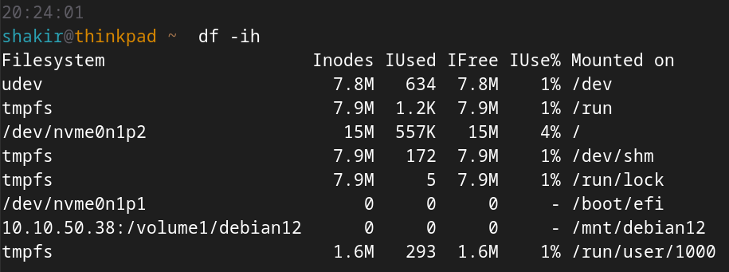

In Unix-like operating systems, an inode (short for "index node") is a data structure that stores metadata about a file or directory. Each file or directory on a filesystem is associated with a unique inode which contains information such as:

- File type (regular file, directory, symbolic link, device file, etc.)[^1].
- Permissions (read, write, execute) for the owner, group, and others.
- Ownership (user and group) of the file.
- File size in bytes.
- Timestamps indicate when the file was accessed and modified and when the inode itself was last modified[^2].
- The number of hard links to the file[^3].
- Disk block pointers point to the data blocks on the storage device.

In this post, I'll cover the essentials of inodes – how to identify issues tied to them, and ways to troubleshoot. Keep in mind that inodes can become quite complex becose they touch various parts of the filesystem and storage structure. So for the sake of keeping this post simple, we won't dive into all those complexities.

## Why the system we needs something like inodes?

When you create a file or directory, there is metadata associated with it, including: file name, size, type, permissions, owner, group, and more. The operating system needs something to manage the file's metadata as well as its location of data blocks on the disk.This is in general. The specific implementation and terminology may vary slightly depending on the filesystem and the OS version.

Therefore, an inode is allocated to store the file (or directory) metadata, which allow the filesystem to properly manage file access and storage. This also make operations like finding files by name, checking permissions, and tracking file sizes easy for the OS.

## Inode capacity

For a filesystem, there is a quota for its inodes. The number of inodes available on a filesystem is determined during the filesystem formatting and is usually fixed number. This means that if a filesystem runs out of available inodes, you may be unable to create new files or directories, even if there is a free disk space. 

### In inode, we trust!

So, there is a capacity for inodes — great. But what happens if we run out of them?

Running out of inodes (inode exhaustion) can lead to weird system failures. You might suspect that the system has run out of available inodes when a program or process fails to create a file or directory due to insufficient storage, as the error message indicates.

Generally, it is unlikely to run out of inodes before running out of storage. But this is not impossible, especially when there are a lot of processes *writing small files* constantly for a long time.

So if you can't create a file, and the error message states that you do not have enough space, even though you have disk space, then most likely you've run out of inodes.

## Reasons for inodes exhaustion

Inode exhaustion can be caused by (but not limited to) the following factors:

### Small files and directories

If you have a ton of very small files and directories, each will consume an inode. This can quickly deplete the available inode pool, even if there is plenty of free space on the disk.

### Lots of small writes

Related the previous point, frequent small writes, such as those caused by a lot of logging or temporary file creation, can contribute to inode exhaustion. These small writes create new inodes each time, and on the long run this can lead to a depletion of available inodes.

### Temporary files

Applications that generate many temp files without cleanup can exhaust inodes. These temporary files accumulate and consume inodes if they are not frequently cleaned up.

### Software builds and compilation

Software development processes involving frequent compilation and code builds can create many temp files and directories. For example, building NodeJS apps is known for creating a ton of small files and cache. Over time, these files can contribute to inode exhaustion.

### Excessive filesystem operations

Certain applications or scripts that frequently create, modify, or delete files and directories can lead to inode exhaustion if not properly controlled.

### Bundeld Servers

Mail servers, content management servers (e.g., WordPress), and backup servers can also be reasons for running out of inodes. So, it's a good practice to be aware of how these servers operate and how they interact with the file system.

## How to fix inode exhaustion?

First, ensure whether you’re running out of inodes or not:

You might think that just restarting the server would fix the problem, but that's not necesserly right. The issue is more about the filesystem itself and not the operating system processes.

The filesystem is persisted on disk, so a reboot does not modify the underlying filesystem properties. If the filesystem was already experiencing inode exhaustion before the reboot, the same issue will persist after the reboot.

A reboot *might* be helpful only to clear out stale or stuck processes that keep trying to write tiny files. But the reboot itself does not directly fix the underlying filesystem issue.

### Identify the issue

- Monitor filesystem usage and identify when inode exhaustion occurs.
- Review error messages, logs, and filesystem reports to determine the cause of the issue.
- If you encounter an error message indicating insufficient storage capacity, despite being certain that there is available space, it may suggest an inode issue.

### Cleanup and delete unnecessary files

- Identify and delete unnecessary files. Check users' files, and ensure temporary files are cleaned up.
- Check out the `/tpm` directory; applications usually use this location for scratch/cache data.
- Clear the cache of package managers by using their command line options or manually locate and remove their cache directory.
- Use tools like `find` to locate and delete no longer needed files.
- Clean up old log files, and ensure `logrotate` is enabled and properly configured.

### Storage optimization

- Consider compressing unused files.
- Remove redundant files.
- Avoid excessive nested directories.
- Consider using alternative storage like a NAS or other network filesystem.

### Prevent it from happening again

- Implement regular automated cleanup tasks.
- Reorganizing and tidying up the whole filesystem might be needed, this will need a storage expert.
- If you're running into this problem often while compiling software in your CI/CD pipeline, you might want to think about using a Docker container to build the app and then stash away the build artifacts using Docker bind mounts or [docker exporter](https://docs.docker.com/build/exporters/). Then delete the build left overs.

[^1]: The first column of the left of the output of the `ls -l` command Shows file types. The `c`, `d` are charcter and device files, `l` for symlinks, `d` for directoreis and `-` for files.
[^2]: Use `stat` command to view when a file created, accessed or modified as well as other file info.
[^3]: Unlike symlinks, which are references to file paths, hard links directly reference the underlying data blocks of a file on disk.
